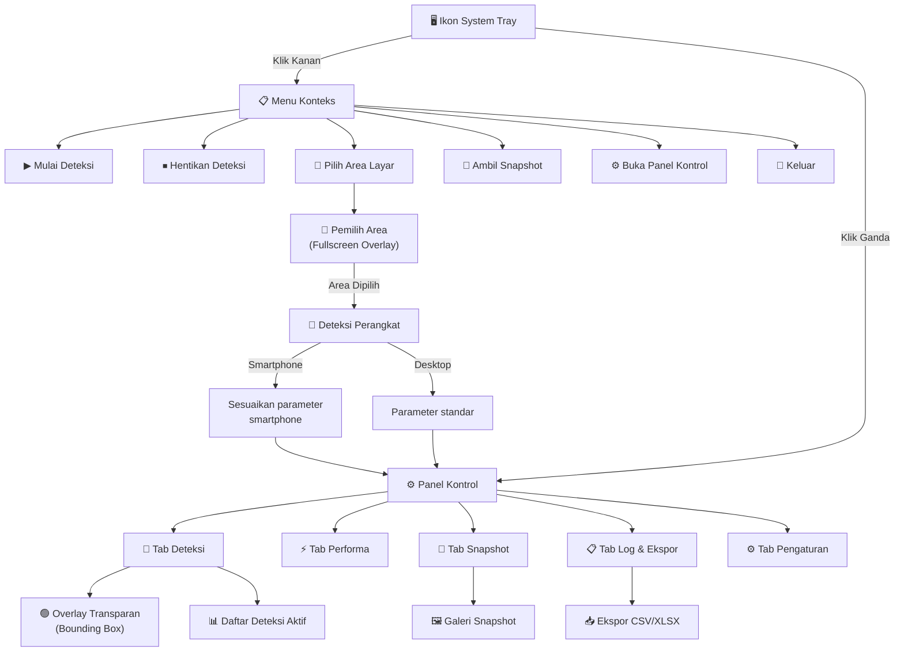
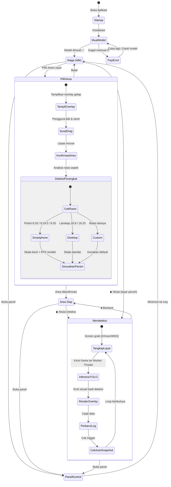

# Frontend Plan — GUI Deteksi Durian YOLO (Updated & Adjusted)

> **Update**: Bahasa UI → Indonesia, Mode → Screen Capture, Varietas → ~10 jenis, Deteksi Perangkat Smartphone → Otomatis
> **Adjustment**: Penambahan arsitektur Threading (QThread), Fallback Screen Capture (DXcam -> MSS), Global Hotkeys, dan Manajemen State Konfigurasi Waktu-Nyata.

---

## Arsitektur Frontend

| Komponen | Pilihan | Detail Implementasi & Alasan |
|---|---|---|
| **Framework GUI** | **PyQt6** | Mendukung *system tray*, jendela transparan, dan sistem *Signals/Slots* yang kokoh. |
| **Threading** | `QThread` & `pyqtSignal` | **Krusial:** Proses inferensi YOLO berjalan di *background thread* agar UI tetap responsif (*tidak freeze*). Komunikasi data ke UI menggunakan *Signals*. |
| **Screen Capture** | `dxcam` (Utama) + `mss` (Fallback) | `dxcam` digunakan untuk menangkap layar hingga 120+ FPS di Windows. Jika gagal (karena isu GPU/DirectX), otomatis beralih ke `mss` yang lebih stabil. |
| **Overlay Window** | `QWidget` dengan `QPainter` | Jendela diatur transparan dan *click-through* menggunakan *Window Flags*: `WindowStaysOnTopHint`, `FramelessWindowHint`, `Tool`, dan `WindowTransparentForInput`. |
| **Styling** | QSS + Custom Palette | Tema gelap modern yang meniru estetika dasbor web sebelumnya. |
| **State Management**| `ConfigManager` (Singleton) | Menyimpan dan menyiarkan perubahan pengaturan (seperti *threshold*, ketebalan *bounding box*) secara langsung tanpa *restart*. |
| **Global Hotkeys** | `keyboard` / `pynput` | Untuk menangkap tombol pintas (seperti *Space* untuk snapshot) meski aplikasi berada di *background/system tray*. |

---

## Deteksi Perangkat Smartphone

Ketika pengguna memilih area tangkapan (RoI), sistem menganalisis **rasio aspek** dan **resolusi** untuk mendeteksi apakah sumber gambar berasal dari layar smartphone yang di-mirror ke desktop.

### Logika Deteksi

```text
┌─────────────────────────────────────────────────────┐
│  ANALISIS AREA TANGKAPAN                            │
│─────────────────────────────────────────────────────│
│                                                     │
│  Rasio Aspek Area:                                  │
│                                                     │
│  ┌──────┐   Potret (9:16, 9:19.5, 9:20)            │
│  │      │   → 🔲 SMARTPHONE terdeteksi             │
│  │      │   → Rotasi frame 0° (tegak)              │
│  │      │   → Skala inferensi disesuaikan           │
│  │      │                                           │
│  └──────┘                                           │
│                                                     │
│  ┌──────────────┐  Lanskap (16:9, 16:10)            │
│  │              │  → 🖥️ DESKTOP/MONITOR             │
│  └──────────────┘  → Mode standar                   │
│                                                     │
│  ┌──────────┐  Persegi (~1:1)                       │
│  │          │  → 📱 SMARTPHONE (crop)               │
│  │          │  → atau custom window                 │
│  └──────────┘                                       │
│                                                     │
│  Resolusi Umum Smartphone:                          │
│  • 360×640, 375×667, 390×844 (standar)              │
│  • 414×896, 428×926 (iPhone Plus/Max)               │
│  • 360×780, 412×915 (Android umum)                  │
│                                                     │
└─────────────────────────────────────────────────────┘
```

### Penyesuaian Otomatis per Perangkat

| Aspek | Smartphone | Desktop/Monitor |
|---|---|---|
| **Ukuran inferensi YOLO** | 416×416 (lebih kecil, lebih cepat) | 640×640 (standar) |
| **Ketebalan bounding box** | 1-2 px | 2-3 px |
| **Ukuran font label** | 10-12 px | 14-16 px |
| **FPS default** | 5 FPS | 10 FPS |
| **Overlay mini-status** | Disembunyikan (layar kecil) | Tampil di sudut kanan atas |

---

## Alur Navigasi Lengkap (Mermaid)



## State Machine Lengkap (Mermaid)



---

## Warna Bounding Box — 10 Varietas

| # | Varietas | Warna | Hex |
|---|---|---|---|
| 1 | Bawor | Hijau terang | `#22C55E` |
| 2 | Montong | Biru langit | `#3B82F6` |
| 3 | Musang King | Emas | `#EAB308` |
| 4 | Petruk | Ungu | `#A855F7` |
| 5 | Monthong | Merah muda | `#EC4899` |
| 6 | Sunan | Oranye | `#F97316` |
| 7 | Kani | Cyan | `#06B6D4` |
| 8 | Matahari | Merah | `#EF4444` |
| 9 | Sitokong | Lime | `#84CC16` |
| 10 | Lainnya | Abu-abu | `#94A3B8` |

---

## Peta File Frontend (Disesuaikan)

```text
d:\GUI Duren\
├── main.py
├── requirements.txt
├── ui/
│   ├── __init__.py
│   ├── app.py
│   ├── tray_icon.py
│   ├── control_panel.py
│   ├── overlay_window.py           # Menangani Qt.WindowTransparentForInput
│   ├── roi_selector.py
│   ├── tabs/
│   │   ├── __init__.py
│   │   ├── detection_tab.py
│   │   ├── performance_tab.py
│   │   ├── snapshot_tab.py
│   │   ├── log_tab.py
│   │   └── settings_tab.py
│   ├── widgets/
│   │   ├── __init__.py
│   │   ├── confidence_slider.py
│   │   ├── fps_slider.py
│   │   ├── detection_list.py
│   │   ├── resource_monitor.py
│   │   ├── snapshot_gallery.py
│   │   └── log_table.py
│   └── styles/
│       ├── theme.py
│       └── stylesheet.qss
├── core/
│   ├── __init__.py
│   ├── config_manager.py           # [BARU] Pengelola state & pengaturan
│   ├── screen_capture.py           # [UPDATE] Fallback dxcam -> mss
│   ├── yolo_engine.py
│   ├── detection_worker.py         # [UPDATE] Berjalan via QThread
│   ├── snapshot_manager.py
│   ├── log_manager.py
│   ├── device_detector.py          
│   └── global_hotkeys.py           # [BARU] Pendengar keyboard global
├── assets/
│   ├── icons/
│   └── sounds/
└── config/
    └── default_config.json
```
